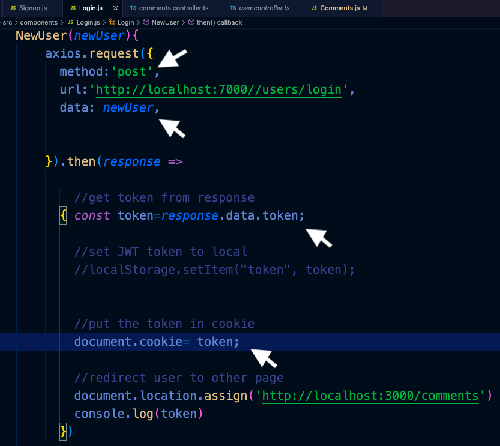
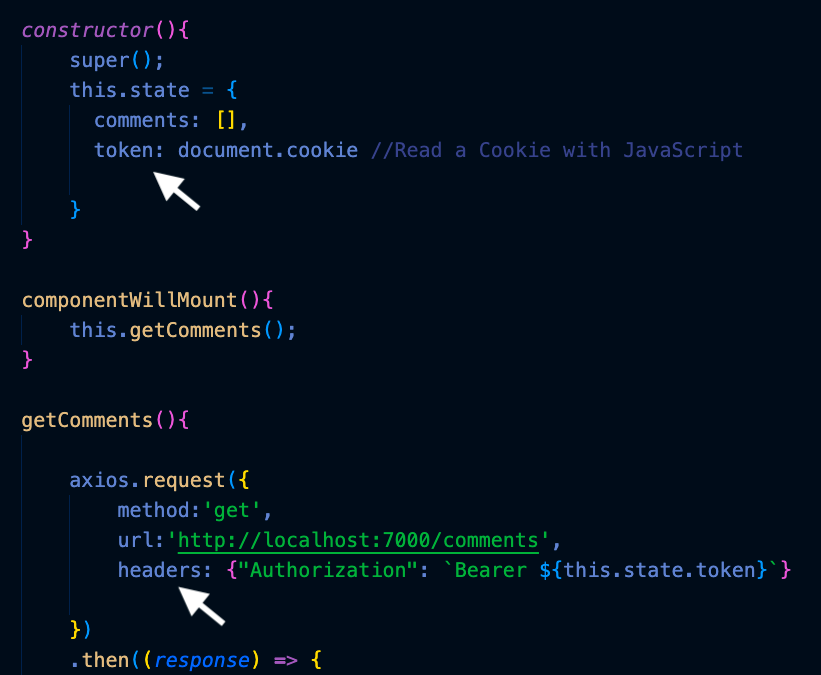

## LoopBack-React-MongoDb-Authentication Tutorial

YouTube refrence is a tutorial in 5 parts as :

```
https://www.youtube.com/watch?v=Mx-cywTNy8s

https://www.youtube.com/watch?v=idvCKXXFGs4&t=1622s

https://www.youtube.com/watch?v=R3wiX05SJps&t=698s

https://www.youtube.com/watch?v=yN5qKqLDlpM

https://www.youtube.com/watch?v=M_PaFaIf6d8


```

and the Github repo:

```
https://github.com/bradtraversy/meetupz

```

This is not necessary but if mongodb installed localy then:
```
sudo service mongodb start

```
Mongodb is not installed locally so :

Install LoopBack (LoopBack 4) locally

```
refer to LoopBack documentation
```
start with lb4 and start to create a project
```
lb4 <Name>
```
## How to connect the LoopBack to mongoDB

```
lb4 datasource
```
choose the Datasource name as "db".

and choose the "MongoDB(supported by StrongLoop) " for Select the connector for db list.

and put the mongodb url as follow:

```
mongodb+srv://aliali:<PASSWORD>@ali.3huc2.mongodb.net/ali

```
do not forget to replace <Password> by the real one.

## Create Model

```
lb4 model
```
** do not forget that the id property is _id and its type is string as we connected to mongodb

```

? Model class name: comments
? Please select the model base class Entity (A persisted model with an ID)
? Allow additional (free-form) properties? Yes
Model Comments will be created in src/models/comments.model.ts

Let's add a property to Comments
Enter an empty property name when done

? Enter the property name: _id
? Property type: string
? Is _id the ID property? Yes
? Is _id generated automatically? Yes

Let's add another property to Comments
Enter an empty property name when done

? Enter the property name: name
? Property type: string
? Is it required?: No
? Default value [leave blank for none]:

Let's add another property to Comments
Enter an empty property name when done

? Enter the property name: title
? Property type: string
? Is it required?: No
? Default value [leave blank for none]:

Let's add another property to Comments
Enter an empty property name when done

? Enter the property name: comm
? Property type: string
? Is it required?: No
? Default value [leave blank for none]:


```

## Create repository

```
lb4 repository
```
```
? Select the datasource DbDatasource
? Select the model(s) you want to generate a repository for Comments
```

## Create controller

```
lb4 controller
```

```
? Controller class name: comments
Controller Comments will be created in src/controllers/comments.controller.ts

? What kind of controller would you like to generate? REST Controller with CRUD functions
? What is the name of the model to use with this CRUD repository? Comments
? What is the name of your CRUD repository? CommentsRepository
? What is the name of ID property? _id
? What is the type of your ID? string
? Is the id omitted when creating a new instance? Yes
? What is the base HTTP path name of the CRUD operations? /comments
```

** The back end is ready and works perfect


## How to secure your LoopBack 4 application with JWT authentication

See the lb4 documentation:
```
https://loopback.io/doc/en/lb4/Authentication-tutorial.html
```
this documentation is describing the following steps:

Step 1:

```
npm i --save @loopback/authentication @loopback/authentication-jwt

```

Step2:

In src/application.ts, bind the authentication components to your application class.

src/application.ts

```


// ---------- ADD IMPORTS -------------
import {AuthenticationComponent} from '@loopback/authentication';
import {
  JWTAuthenticationComponent,
  SECURITY_SCHEME_SPEC,
  UserServiceBindings,
} from '@loopback/authentication-jwt';
import {DbDataSource} from './datasources';
// ------------------------------------

export class TodoListApplication extends BootMixin(
  ServiceMixin(RepositoryMixin(RestApplication)),
) {
  constructor(options: ApplicationConfig = {}) {
    //...


    // ------ ADD SNIPPET AT THE BOTTOM ---------
    // Mount authentication system
    this.component(AuthenticationComponent);
    // Mount jwt component
    this.component(JWTAuthenticationComponent);
    // Bind datasource
    this.dataSource(DbDataSource, UserServiceBindings.DATASOURCE_NAME);
    // ------------- END OF SNIPPET -------------


  }
}

```

Step 3:

add the user Controller:

NOTE: this user controller will add the User and Usercredentials collections to mongodb datsabase to restor everythings.

this User controller source is from
 "https://github.com/loopbackio/loopback-next/blob/master/examples/todo-jwt/src/controllers/user.controller.ts"

```
// Copyright IBM Corp. and LoopBack contributors 2020. All Rights Reserved.
// Node module: @loopback/example-todo-jwt
// This file is licensed under the MIT License.
// License text available at https://opensource.org/licenses/MIT

import {authenticate, TokenService} from '@loopback/authentication';
import {
  Credentials,
  MyUserService,
  TokenServiceBindings,
  User,
  UserRepository,
  UserServiceBindings,
} from '@loopback/authentication-jwt';
import {inject} from '@loopback/core';
import {model, property, repository} from '@loopback/repository';
import {
  get,
  getModelSchemaRef,
  post,
  requestBody,
  SchemaObject,
} from '@loopback/rest';
import {SecurityBindings, securityId, UserProfile} from '@loopback/security';
import {genSalt, hash} from 'bcryptjs';
import _ from 'lodash';

@model()
export class NewUserRequest extends User {
  @property({
    type: 'string',
    required: true,
  })
  password: string;
}

const CredentialsSchema: SchemaObject = {
  type: 'object',
  required: ['email', 'password'],
  properties: {
    email: {
      type: 'string',
      format: 'email',
    },
    password: {
      type: 'string',
      minLength: 8,
    },
  },
};

export const CredentialsRequestBody = {
  description: 'The input of login function',
  required: true,
  content: {
    'application/json': {schema: CredentialsSchema},
  },
};

export class UserController {
  constructor(
    @inject(TokenServiceBindings.TOKEN_SERVICE)
    public jwtService: TokenService,
    @inject(UserServiceBindings.USER_SERVICE)
    public userService: MyUserService,
    @inject(SecurityBindings.USER, {optional: true})
    public user: UserProfile,
    @repository(UserRepository) protected userRepository: UserRepository,
  ) {}

  @post('/users/login', {
    responses: {
      '200': {
        description: 'Token',
        content: {
          'application/json': {
            schema: {
              type: 'object',
              properties: {
                token: {
                  type: 'string',
                },
              },
            },
          },
        },
      },
    },
  })
  async login(
    @requestBody(CredentialsRequestBody) credentials: Credentials,
  ): Promise<{token: string}> {
    // ensure the user exists, and the password is correct
    const user = await this.userService.verifyCredentials(credentials);
    // convert a User object into a UserProfile object (reduced set of properties)
    const userProfile = this.userService.convertToUserProfile(user);

    // create a JSON Web Token based on the user profile
    const token = await this.jwtService.generateToken(userProfile);
    return {token};
  }

  @authenticate('jwt')
  @get('/whoAmI', {
    responses: {
      '200': {
        description: 'Return current user',
        content: {
          'application/json': {
            schema: {
              type: 'string',
            },
          },
        },
      },
    },
  })
  async whoAmI(
    @inject(SecurityBindings.USER)
    currentUserProfile: UserProfile,
  ): Promise<string> {
    return currentUserProfile[securityId];
  }

  @post('/signup', {
    responses: {
      '200': {
        description: 'User',
        content: {
          'application/json': {
            schema: {
              'x-ts-type': User,
            },
          },
        },
      },
    },
  })
  async signUp(
    @requestBody({
      content: {
        'application/json': {
          schema: getModelSchemaRef(NewUserRequest, {
            title: 'NewUser',
          }),
        },
      },
    })
    newUserRequest: NewUserRequest,
  ): Promise<User> {
    const password = await hash(newUserRequest.password, await genSalt());
    const savedUser = await this.userRepository.create(
      _.omit(newUserRequest, 'password'),
    );

    await this.userRepository.userCredentials(savedUser.id).create({password});

    return savedUser;
  }
}
```
step 4:

do not forget to add this in comment controller file before the class to make a lock

```
import {authenticate} from '@loopback/authentication';
@authenticate('jwt')

```


## React (Front-End)

You can create a new React app in the current directory(client) by writing . instead of a project name.

```
npx create-react-app .
```


We need to add this file called setupProxy.js under the src folder of the React App. You do not need to import this file anywhere. It is automatically registered when you start the development server.

```
const { createProxyMiddleware } = require('http-proxy-middleware');

module.exports = function(app) {
  app.use(
    '/api',
    createProxyMiddleware({
      target: 'http://localhost:7000',
      changeOrigin: true,
    })
  );
};
```
then in Back-end>SRC>index.ts change the port from 3000 to 7000 like;
```
port: +(process.env.PORT ?? 7000),
```

then:

```
npm i react-router-dom
```

## How to make a unique Email(User)

It is true that we have the option of (unique:true) in user>email>model able to see it here at node_modeule>@loopback>authentication-jwt>dist>models.iser.model.js , BUT it does not work at mongodb.

to be able to make a unique index for email we need to enter the follow script from CLI of mongodb OR: we can :

1- log in mongodb.com
2- choose the data and collection (User)
3- choose the indexes from right side window
4- push the CREAT INDEX button
5- Fill up the form like the picture

6- Push the reviw button and all done

The CLI script is:

```
db.<collection>.createIndex({ <field>: <type> } { unique: true} )
```
In MongoDB, a single (field) index is an index that references one field from a document.
(type) specifies whether the indexed values should be arranged in ascending or descending order. A value of 1 or -1 is used to order values in ascending or descending order, respectively.choose -1 pls.

In Options:The following options document specifies the unique option and the name for the index:

```
{ unique: true, name: "myUniqueIndex" }

```

## Authorization and Authentication (JWT)
LocalStorage vs Cookies: All You Need To Know About Storing JWT Tokens Securely in The Front-End

```
https://dev.to/cotter/localstorage-vs-cookies-all-you-need-to-know-about-storing-jwt-tokens-securely-in-the-front-end-15id
```
https://loopback.io/doc/en/lb3/Making-authenticated-requests.html#enable-vanity-user-urls

** in order to block a controller like comments, based on lb4 documents we need just to put this befor comments class controller:

```
import {authenticate} from '@loopback/authentication';

@authenticate('jwt')
```


** in order to obtain a token we need to send credentials(email and password) by post request in login page, and then receive the token as RESPONSE in login page and stor ot in cookie.



** in order to send the token to header Authorization and unlock the comments we need to put the token in header properties in get REQUEST comments.




## For CSS front-end using these libreries:

```
https://materializecss.com/

```
The simple css format will easily change just by add the following links in to index.html in public folder:

```
1- copy and paste the CDN link and script from materializecss in to index.html.
2- copy and paste the CDN script from minified link of "Jquery cdn" in to index.html
3- copy and paste the CDN link from " font awsome cdn" in to index.html
```
 by adding the mentioned links and scripts the format of fonts and forms will change automaticly.


```
https://reactrouter.com/
```


# How to push to heroku
```
https://more-modise.medium.com/how-to-deploy-loopback-4-application-in-heroku-3d059b73cbd5
```

```
npm i concurrently
```
